# autonomous_car_driving 
This repository describes procedure for:
- downloading Udacity's self driving car simulator.
- launching the car simulator and creating the training dataset.
- codes for cleaning and preprocessing of the training images.
- creation and training of CNN model for predicting steering angles.
- running a Flask server to fetch the image from the simulator, predict the steering angle and send the steering angle to the simulator.

--------------------------------------
Download the [Udacity's self driving car simulator](https://github.com/udacity/self-driving-car-sim) and create the training dataset. I've made use of **Version 1** of the simulator for Linux operating system.
- Extract the files locally. Launch the simulator with command
```
$ cd path_to_simulator/
$ ./Default\ Linux\ desktop\ Universal.x86_64
```
Choose the resolution and graphics quality. I've kept 640x480 resolution with fastest graphics quality for speedier operation. Press 'OK' once done.

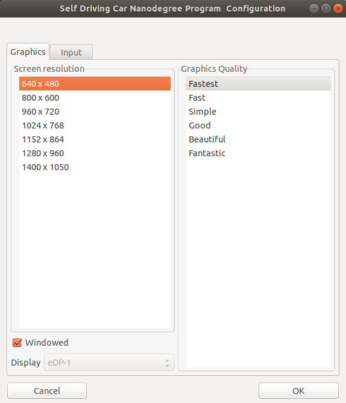

You'll be able to see the simulator as shown below in case you're using **Version 1** simulator.

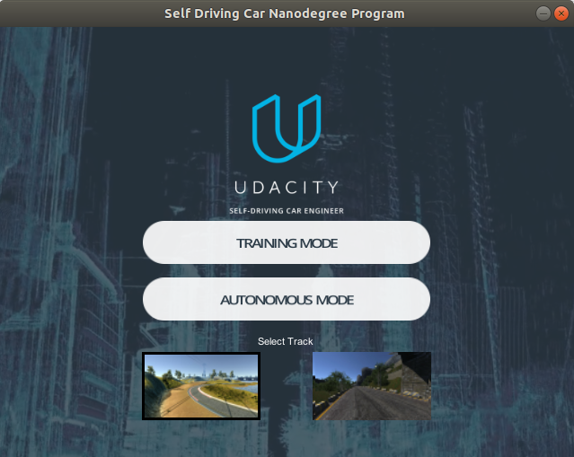

Choose the track and click on training mode to start recording training data. I've collected training images only from the sunny track. No training images were collected from the darker track.

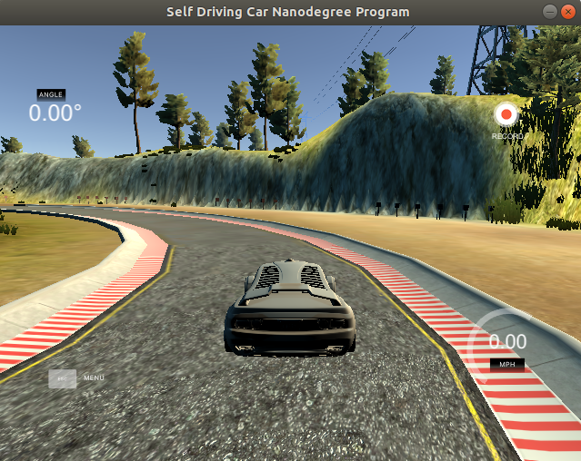

- Click on record, provide the path to the folder for storing data and click on select. 
- To move the car use keys
  - Arrow Up: accelerate 
  - Arrow down: decelerate
  - Arrow right: turn right
  - Arrow left: turn left
- Collect the data by driving on both directions of the track with one lap in each direction. This will ensure that you'll have enough images for right and left turns. You can pause the record when you want to switch the direction of car on the track.
- After recording you'll see 
  - folder 'IMG' with all training images from left, right and center camera of the car.
  - file 'driving_log.csv' consisting of steering, throttle, reverse and speed for each set of images.

--------------------------------------
Run the 'steering_angle_dnn.ipynb' in jupyter notebook. You can use [google-colab](https://colab.research.google.com) to train the model in case you don't have gpu in your computer.

List showing the center, left, right image names with steering, throttle, reverse and speed values for the top 5 data from the 'driving_log.csv' file.

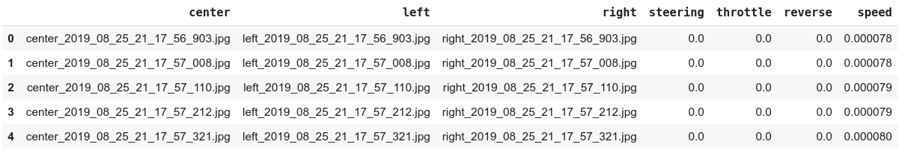

Plotting the distribution of training samples vs the steering values we find that we have lot of training data for steering value around 0.0. This is because we have a lot straight road track.

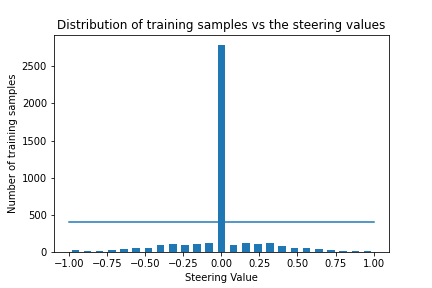

Although we would like to drive the car without any turns on straight road but we don't want the model to be too biased for driving straight. Hence, we truncate the number of samples to 400 samples for steering values aroung 0.0.
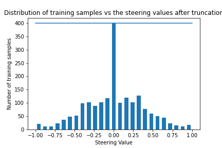

The dataset is split into ratio of 80:20 as training and validation dataset. Distribution of samples in training and validation dataset after the split.
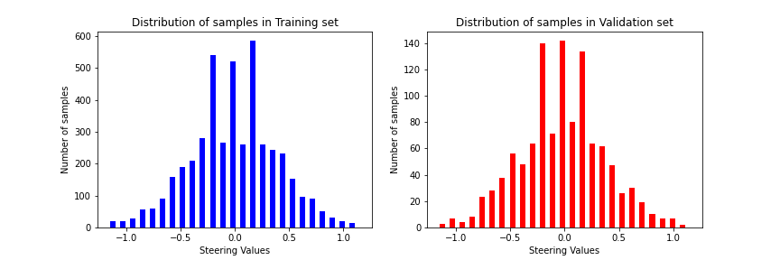

[imgaug library](https://imgaug.readthedocs.io/en/latest/) is used for augmentation of the training data with brightness variation, translation along horizontal and vertical direction, horizontal flipping and zooming of images. Below shows results of augmentation applied on random images.
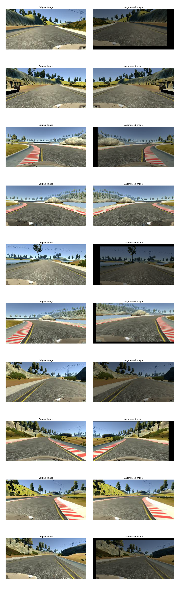

Preprocessing of images is carried out by first cropping the image so that only the road is visible, converting the image from RGB to YUV color space and applying gaussian blur operation to smoothen the image. Experimental results on other machine vision applications show that YUV color space provide better results compared to RGB color space due to its perceptual similarities to
the human vision. Hence, we training the model with YUV images.
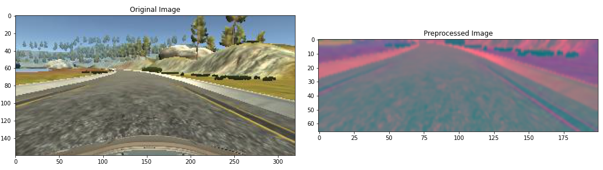

Batch generator functions is defined to generate the required number of training/validation samples for each batch. For training batch random augmentation procedure is applied before preprocessing and for validation batch only the preprocessing procedure is applied. 

--------------------------------------
CNN model created for training
- Convolutional layer with 24 filters with kernel size (5,5) and strides (2,2)
- elu activation layer
- Convolutional layer with 36 filters with kernel size (5,5) and strides (2,2)
- elu activation layer
- Convolutional layer with 48 filters with kernel size (5,5) and strides (2,2)
- elu activation layer
- Convolutional layer with 64 filters with kernel size (3,3)
- elu activation layer
- Convolutional layer with 64 filters with kernel size (3,3)
- elu activation layer
- Dropout layer with dropout rate of 25%
- Fully connected layer with 100 units
- elu activation layer
- Fully connected layer with 50 units
- elu activation layer
- Fully connected layer with 10 units
- elu activation layer
- Fully connected layer with 1 unit
- elu activation layer
- Adam optimizer with learning rate=0.001 is used for updating the model parameters.
- Mean square error is used for loss measurement.

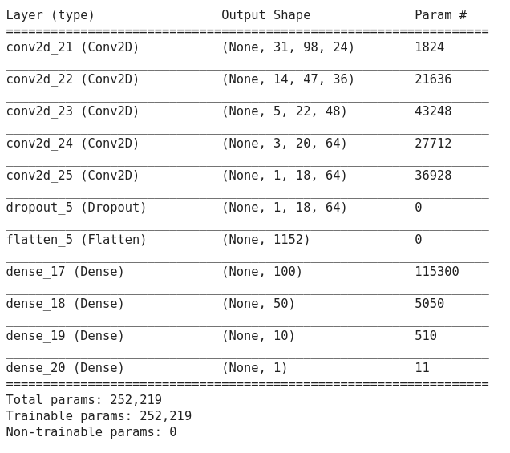

--------------------------------------
Model is trained for 10 epochs using batch generator with 100 training images per batch and 100 validation images per batch. Per epoch 300 batches of training is carried out, while in 200 validation steps is carried out after each epoch. Took about 25mins of training time.

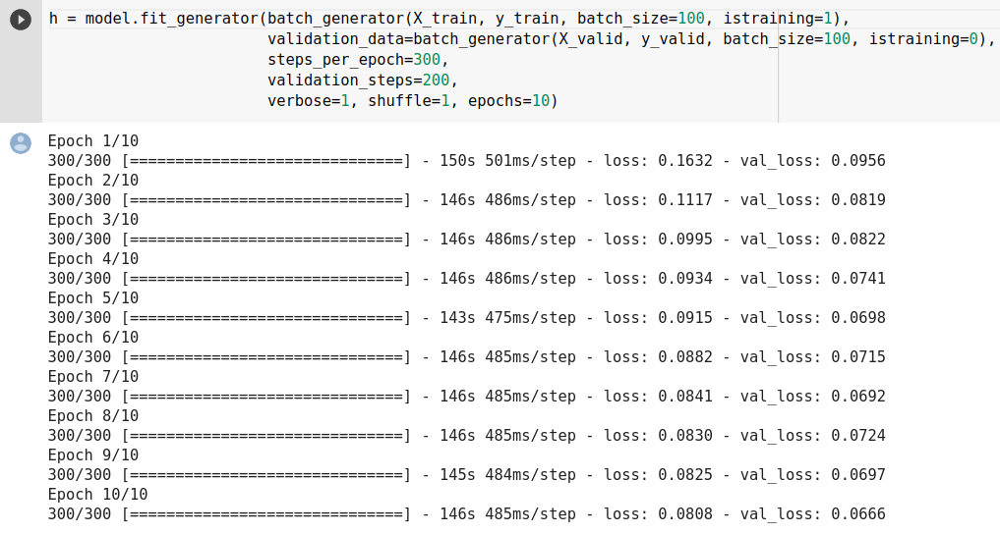

Plot of loss curve for training and validation data

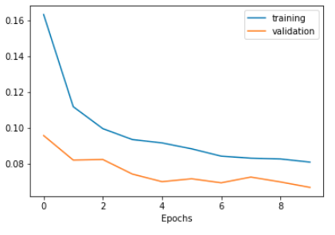

--------------------------------------
The trained model is saved locally. Use the drive.py to load the trained model, connect to the simulator, obtain the telemetry data, pass the images through the model and send the steering angle to simulator. The throttle is calculated so as to maintain a constant speed of 20.

Install
```
$ sudo apt-get install python-socketio python-eventlet python-flask
```

Run to drive in autonomous mode. Choose the track you want to drive in. Give sometime for the model to load after running drive.py
```
$ cd root_path/autonomous_car_driving/
$ python drive.py
$ cd path_to_simulator/
$ ./Default\ Linux\ desktop\ Universal.x86_64
```

You can check out the result on driving on both sunny track and dark track with the model in the video.
[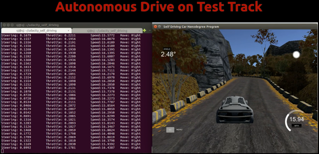](https://youtu.be/ozstXJIiAoA)
